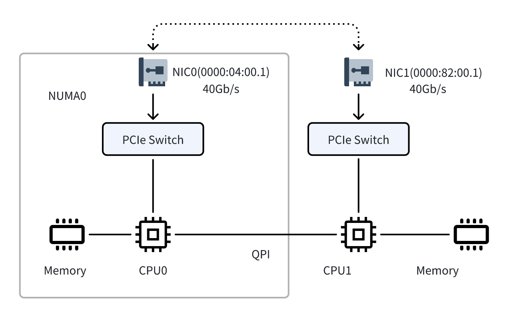

# Artifact Evaluation for Final Year Project (FYP)

## Overview

This repository is for artifact evaluation(i.e., 软硬件验收 in Chinese) of final year project(FYP) in Xidian University.

[Section 2](#setup-environment) contains necessary steps to set up the testbed to reproduce the result. [Section 3](#generate-packets-trace) gives instruction to generate the trace used in the evaluation. [Section 4](#reproducing-the-results) provides detailed instruction to reproduce the result in bachelor thesis.

## Setup environment

Testbed Overview:




Install Dependencies:

```bash
pip install scapy
sudo apt-get install libpcap-dev linux-tools-5.4.0-214-generic
```

System configuration:

```bash
# for perf
cat /proc/sys/kernel/perf_event_paranoid
echo "-1" | sudo  tee /proc/sys/kernel/perf_event_paranoid
# disable turbo boost
cat /sys/devices/system/cpu/intel_pstate/no_turbo
echo "1" | sudo tee /sys/devices/system/cpu/intel_pstate/no_turbo

# Two NUMA node here
# Hugepage setup
echo 2048 | sudo tee /sys/devices/system/node/node0/hugepages/hugepages-2048kB/nr_hugepages
echo 2048 | sudo tee /sys/devices/system/node/node1/hugepages/hugepages-2048kB/nr_hugepages
mkdir /mnt/huge
mount -t hugetlbfs pagesize=1GB /mnt/huge
```

DPDK setup: 
```bash
# add the NIC used in experiment
sudo dpdk-devbind.py -b vfio-pci 0000:82:00.1
sudo dpdk-devbind.py -b vfio-pci 0000:04:00.1
pkg-config --modversion libdpdk # show dpdk version
```

Compile the program used in motivation section:

```bash
make -C ./motivation
```

Compile the program used in evaluation section (including aggregator implementation):

```bash
make -C ./aggregator
```

## Generate packets trace and configuration file for firewall

Generate packets trace for motivation and evaluation:
```bash
# Machine time: ~40 min (can be parallelized)
./scripts/run_motivation.py --prepare
# Machine time: ~6 min
./scripts/run_evaluation.py --prepare
```

## Reproducing the results

### Results for motivation

```bash
# Machine time: ~ 32 minutes
./scripts/run_motivation.py --run
```

### Results for evaluation

```bash
# Machine time: ~20 minutes
sudo ./scripts/run_evaluation.py --run --buffer-time
```

### Clean up all the results and traces

```bash
# remove results
rm -rf ./result
# remove traces 
rm -rf *.pcap
```